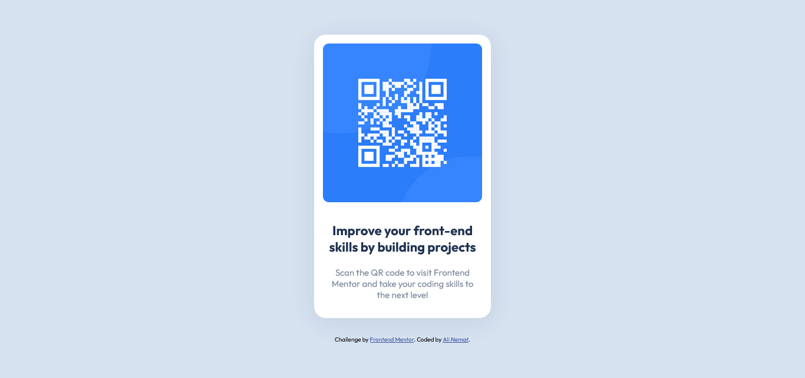

# Frontend Mentor - QR code component solution

This is a solution to the [QR code component challenge on Frontend Mentor](https://www.frontendmentor.io/challenges/qr-code-component-iux_sIO_H). Frontend Mentor challenges help you improve your coding skills by building realistic projects. 

## Table of contents

- [Overview](#overview)
  - [Screenshot](#screenshot)
  - [Links](#links)
- [My process](#my-process)
  - [Built with](#built-with)
  - [Continued development](#continued-development)
- [Author](#author)

## Overview

### Screenshot

### Links

- Live Site URL: [Check it Online (Click!)](https://your-live-site-url.com)

## My process
  
### Built with

- Semantic HTML5 markup
- CSS custom properties
- Flexbox

### Continued development

in future projects, I'm going to focus on optimize usage of HTML/CSS & write a better code!

## Author

- Website - [Ali Nemat](https://www.alinemat.ir)
- Frontend Mentor - [@AliNematt](https://www.frontendmentor.io/profile/AliNematt)
- Instagram - [@alinemat.ir](https://www.instagram.com/alinemat.ir)
